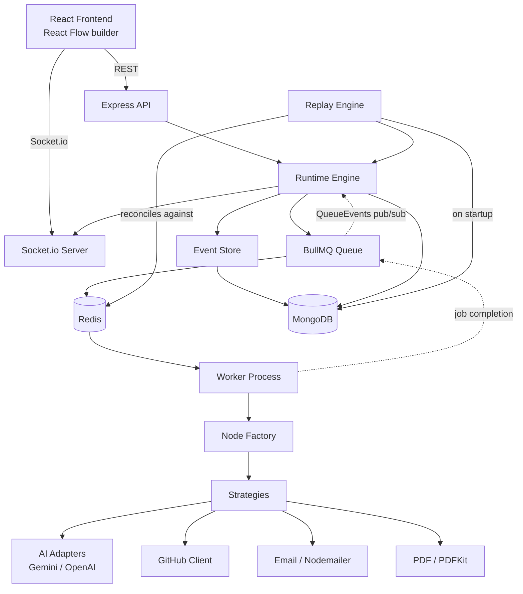

# FlowEngine
{"host":"smtp.gmail.com","port":587,"user":"karandesid25@gmail.com","pass":"YOUR_APP_PASSWORD"}
**A Visual Durable Workflow Engine for AI Applications**

---
<!-- 1. Validate Repository → repo: github.com/sudeshkarande73/filegate

2. Fetch Metadata → url: api.github.com/repos/sudeshkarande73/filegate, method GET

3. Read README → url: raw.githubusercontent.com/sudeshkarande73/filegate/main/README.md, method GET -->

## 1. Overview

FlowEngine is a workflow automation engine — build it first, make it durable. You design AI pipelines visually, as connected nodes on a canvas, the same way you would in n8n. What FlowEngine adds on top is the part most automation tools skip: if the server crashes mid-execution, the workflow **resumes exactly where it left off** on restart. No repeated work, no duplicated side effects (no double-sent emails, no double-generated PDFs), and no lost progress — provable, not just claimed, because every step is recorded as an immutable event before it's acted on.

**The problem this solves:** visual automation tools (n8n) optimize for ease of use but don't treat durable execution as a first-class concern. Durable-execution platforms (Temporal) solve reliability but require writing workflows entirely in code, with a steep operational learning curve and no visual layer. FlowEngine is the deliberate middle: a lightweight, self-hosted, fully-owned implementation of the pattern Temporal/Restate/DBOS productize, built from scratch specifically so every part of it is explainable — not a black-box SDK import.

## 2. Key Features

- **Visual workflow builder** — React Flow canvas, drag nodes from a categorized library, connect them, configure them
- **Durable execution** — event-sourced runtime; crash recovery is automatic on every server restart
- **Event sourcing** — an append-only event log is the actual source of truth; all derived state (status, current node, completed outputs) is computed by folding over it, not read from a cache
- **Replay Engine** — reconciles MongoDB's event log against BullMQ's real job state on every startup, catching up anything that happened while the API was offline
- **Retry & Node Replay** — automatic retry with exponential backoff for transient failures, manual retry for permanently failed executions, and isolated replay of any single completed node for inspection/comparison
- **Real AI integration** — Gemini and OpenAI behind a genuine Adapter-pattern interface, swappable per node
- **GitHub, Email, PDF integrations** — real API calls, real SMTP delivery, real generated PDFs (Architecture Summary and Resume templates)
- **Encrypted credential vault** — AES-256-GCM, per-user, never returned to the frontend in full
- **Live execution monitoring** — Socket.io, scoped per-execution with ownership verification, not a global broadcast
- **Crash-recovery visualization** — the "what did we save" summary, showing exactly which stages survived and where execution resumed

## 3. Architecture



**Component responsibilities:**

| Component | Responsibility |
|---|---|
| **Runtime Engine** (`runtime/engine.js`) | Owns orchestration: starts executions, decides the next node, reacts to job completion/failure via `QueueEvents` (not the Worker's own events — that only works cross-process for exactly this reason) |
| **Event Store** (`runtime/eventStore.js`) | The only code path allowed to write to the event log. Atomic `$push`, never fetch-modify-save |
| **Replay Engine** (`runtime/replay.js`) | Runs on every API startup. Reconciles MongoDB against real BullMQ job state — this is the actual crash-recovery mechanism |
| **Node Factory** (`runtime/factory.js`) | Resolves a node's `type` to its concrete `Strategy` class — the only file that changes when a new node type is added |
| **Worker** (`worker.js`) | A deliberately dumb, separate process. Executes exactly one node via its Strategy and returns a result. Knows nothing about the DAG |
| **Socket.io layer** (`sockets/`) | JWT-authenticated connections, per-execution rooms with ownership verification, fault-tolerant (a no-op emitter if uninitialized — monitoring can never break the engine it observes) |

## 4. Durable Execution, Explained

```
Node executes
     │
     ▼
Event stored (BEFORE side effects are considered "done")
     │
     ▼
Execution state updated
     │
     ▼
Next node queued
     │
     ▼
   [ Crash could happen anywhere above or below this line ]
     │
     ▼
Server restarts
     │
     ▼
Replay Engine asks Redis directly: what actually happened to the
in-flight node's job? (not "what did we last hear," but "what is
actually true right now")
     │
     ├─ Job completed while offline → use that result, advance
     │  the chain. NEVER re-run the node's strategy — that would
     │  risk a duplicate side effect (a second email, a second PDF).
     │
     ├─ Job failed while offline → record the failure, same as if
     │  it had happened live.
     │
     ├─ Job still active/waiting → leave it alone. If the worker
     │  itself crashed, that's BullMQ's own stalled-job detection
     │  to handle, not this engine's.
     │
     └─ No job found at all → the crash landed between recording
        intent and actually enqueuing it. No evidence it ran.
        Queue it now.
```

Why completed work is never repeated: the Replay Engine's first move for any in-flight node is to ask *"does BullMQ have direct evidence this already finished?"* before it ever considers re-running anything. That check is what prevents double-executing a node's real-world side effects after a restart.

## 5. Event Sourcing, Explained

An event is an immutable fact: `{ type, nodeId, payload, timestamp }`. Events are never edited or deleted — only appended. Event types are deliberately generic (`NodeCompleted`, not `GeminiCompleted`) so the Runtime Engine never needs to know what a `github` or `aitask` node actually does; domain detail lives entirely in `payload`.

**State is derived, not stored as truth.** `runtime/reconstructState.js` is a pure fold over the event array:

```js
events.reduce((state, event) => {
  switch (event.type) {
    case 'NodeCompleted': /* mark node done, record output */
    case 'NodeFailed':    /* mark failure */
    case 'WorkflowCompleted': /* status = COMPLETED */
    // ...
  }
}, initialState)
```

`WorkflowExecution.status`/`currentNodeId` *do* exist as denormalized fields (for fast list queries) — but they're a projection of the events, provably so: `reconstructState()` derives the same answer independently, purely from the raw log.

**Example — a node replayed after the workflow already completed:**
```
[WorkflowStarted, NodeQueued(n1), NodeCompleted(n1, "first run"), WorkflowCompleted,
 NodeQueued(n1, replay), NodeCompleted(n1, "replayed run")]
```
Folds to: `status: COMPLETED` (unaffected), `completedNodeIds: [n1]` (still just one, not two), `completedNodeOutputs.n1: "replayed run"` (latest wins as current) — while the original event is still sitting untouched in the raw array if you want history. Nothing was overwritten to achieve any of this.

## 6. Crash Recovery Demonstration

Reproducible, start to finish:

```bash
node index.js &      # terminal 1
node worker.js &     # terminal 2

# Trigger a run
curl -X POST http://localhost:5000/api/workflows/<id>/run -H "Authorization: Bearer <token>"

# Wait until 2-3 nodes have completed (watch the worker's log), then:
kill %1               # kill the API process specifically -- NOT the worker

node index.js          # restart it

# Server log should show:
#   [ReplayEngine] Found 1 unfinished execution(s) — reconciling...
#   [ReplayEngine] ...: node nX completed while offline. Catching up.

curl http://localhost:5000/api/executions/<id> -H "Authorization: Bearer <token>"
```

Expected result: `status` progresses from `RUNNING` to `COMPLETED`, `events[]` contains **exactly one** `NodeCompleted` per node (verify this explicitly — it's the whole claim), and the frontend's execution view shows the recovery banner with `lostWork: 0`.

## 7. Workflow Templates

**GitHub Repository Analyzer** — `Validate Repository → Fetch Metadata → Read README → AI Analysis → Generate PDF → Send Email`. The primary technical demonstration; exercises every node type in one linear chain.

**Resume Builder** — `Resume Input → AI Improvement → Generate PDF`. Secondary demo showing the same AI Task + PDF nodes reused for a different purpose (proves the node types are genuinely generic, not GitHub-specific).

## 8. Tech Stack

**Frontend:** React 19, Vite, Tailwind CSS v4, React Flow (`@xyflow/react`), React Router, Axios, Socket.io Client

**Backend:** Node.js, Express 5, MongoDB, Mongoose, Redis, BullMQ, Socket.io, JWT, Node `crypto` (AES-256-GCM), Nodemailer, PDFKit

**AI:** Gemini API, OpenAI API — behind a shared Adapter interface

## 9. Installation

```bash
git clone <repository-url>
cd FlowEngine

cp .env.example backend/.env
# edit backend/.env: generate JWT_SECRET and ENCRYPTION_KEY with
# node -e "console.log(require('crypto').randomBytes(32).toString('hex'))"

cd backend && npm install
cd ../frontend && npm install && cp .env.example .env
```

## 10. Docker Setup

```bash
docker compose up -d
```

Starts MongoDB, Redis, the API, the Worker, and the frontend (served via nginx on port 8080). Verify containers are healthy:
```bash
docker compose ps
``` 
MongoDB and Redis have healthchecks; `api` and `worker` wait for both to report healthy before starting.

> **Note on this repository's own testing:** the Dockerfiles and compose file were written and YAML-validated in the environment that produced this project, but Docker itself wasn't available there to run a live `docker compose up`. Everything else in this README — the backend, the test suite, the crash-recovery mechanism — was verified by actually running it. Treat the Docker path as correct-by-construction and confirm it on your own machine before a live demo.

## 11. Running the Application (without Docker)

```bash
# Terminal 1
docker compose up -d mongodb redis    # or run your own local Mongo/Redis

# Terminal 2
cd backend && npm run start

# Terminal 3
cd backend && npm run worker

# Terminal 4
cd frontend && npm run dev
```

## 12. API Documentation

All routes except `/auth/register` and `/auth/login` require `Authorization: Bearer <token>`.

| Method | Endpoint | Purpose |
|---|---|---|
| POST | `/api/auth/register` | Create account |
| POST | `/api/auth/login` | Get a JWT |
| GET | `/api/auth/me` | Current user |
| GET/POST | `/api/credentials` | List / add an encrypted credential |
| PUT/DELETE | `/api/credentials/:id` | Update / remove a credential |
| GET/POST | `/api/workflows` | List / create a workflow definition |
| GET/PUT/DELETE | `/api/workflows/:id` | Read / update / delete a definition |
| POST | `/api/workflows/:id/run` | Start an execution |
| GET | `/api/executions/:id` | Execution status + full event log + reconstructed state |
| POST | `/api/executions/:id/retry` | Retry a FAILED execution from its failed node |
| POST | `/api/executions/:id/replay` | Isolated replay of any single node (body: `{ nodeId }`) |
| GET | `/api/analytics/summary` | Total executions, success rate, active workflow count |
| GET | `/api/analytics/executions` | Recent execution history |

## 13. WebSocket Events

Connect with `io(url, { auth: { token } })`, then `socket.emit('join:execution', executionId)` — the server verifies you own that execution before adding you to its room; a mismatched attempt is silently ignored.

| Event | Payload | Fires when |
|---|---|---|
| `execution:started` | `{ executionId, entryNodeId }` | A run begins |
| `node:started` | `{ executionId, nodeId }` | BullMQ hands the job to a worker (not queue-time) |
| `node:retrying` | `{ executionId, nodeId, attempt }` | An automatic retry attempt begins |
| `node:completed` | `{ executionId, nodeId, result, isReplay? }` | A node finishes |
| `node:failed` | `{ executionId, nodeId, reason, isReplay? }` | A node fails (only after all automatic retries are exhausted) |
| `execution:completed` | `{ executionId }` | The last node finishes |
| `execution:failed` | `{ executionId, failedNodeId, reason }` | A non-replay node fails permanently |
| `execution:recovered` | `{ executionId, recoveredNodeId, completedNodeIds, resumedFrom, lostWork: 0 }` | The Replay Engine catches up a crashed execution — the core demo moment |

## 14. Security

**Implemented:**
- Passwords hashed with bcrypt; JWTs signed with a dedicated secret, separate from the encryption key
- Every resource lookup is scoped by `userId`, not just by ID — a guessed or leaked ID alone cannot read another user's data
- Credentials encrypted with AES-256-GCM (authenticated encryption — tampered ciphertext fails to decrypt rather than silently returning garbage), decrypted only at the moment of use, never returned to the frontend in full
- Socket.io connections are JWT-authenticated at the handshake; joining an execution's room requires an ownership check, verified directly by testing (not just by reading the code) that a second user genuinely receives nothing for an execution they don't own
- `helmet()` for standard security headers; rate limiting on `/api/auth` specifically (20 requests / 15 min) — the one surface most worth throttling against credential stuffing
- No secrets in logs; centralized error handler strips stack traces outside development

**Explicitly out of scope for this project's size** (stated directly, not glossed over): no refresh-token rotation (JWTs are long-lived, 7 days); CORS is permissive (`origin: '*'`) for local development — must be locked to the real frontend origin before any real deployment; no rate limiting beyond the auth routes; no input sanitization beyond basic presence/type checks; no automated dependency vulnerability scanning configured.

## 15. Design Patterns

- **Factory** (`runtime/factory.js`) — resolves `node.type` to a concrete `Strategy` class. The only file touched when a new node type is added; nothing calling it needs to change.
- **Strategy** (`runtime/strategies/`) — one class per node type, all implementing the same `execute(input, context)` contract. The Worker and Runtime Engine never know which concrete strategy they're holding.
- **Adapter** (`runtime/adapters/`) — used precisely where there are genuinely interchangeable implementations: `IAIProviderAdapter` → `GeminiAdapter`/`OpenAIAdapter`. GitHub/Email/PDF are deliberately *not* forced into this pattern — each has exactly one real implementation, so a swappable-provider interface there would be pure over-engineering. They get isolation instead (raw API calls confined to one place each), which is a different, more honest use of "keep external APIs out of the core."

## 16. Folder Structure

```
FlowEngine/
├── backend/
│   ├── config/          env validation, MongoDB, Redis connection
│   ├── controllers/, routes/, middlewares/, models/
│   ├── runtime/
│   │   ├── engine.js          orchestration
│   │   ├── replay.js          crash recovery
│   │   ├── eventStore.js      append-only writes
│   │   ├── reconstructState.js  event log → state fold
│   │   ├── dagUtils.js        linear-chain traversal
│   │   ├── factory.js         type → Strategy
│   │   ├── strategies/        one class per node type
│   │   └── adapters/          GeminiAdapter, OpenAIAdapter, httpClient
│   ├── sockets/          Socket.io server, auth, room ownership
│   ├── queues/, workers/  BullMQ queue + worker process
│   ├── tests/             real, runnable regression tests
│   ├── index.js           API entry point
│   └── worker.js          Worker entry point (separate process)
├── frontend/
│   └── src/
│       ├── pages/         Landing, Login, Dashboard, WorkflowBuilder, Executions, Credentials
│       ├── components/workflow/  nodeRegistry.js (shared type registry), NodeLibrary, ConfigPanel
│       ├── hooks/         useAuth, useExecutionSocket
│       └── services/      one file per API resource
├── docker-compose.yml
├── .env.example
└── README.md
```

## 17. Testing

```bash
cd backend && npm test
```

**15 tests, all passing, verified in this repository:**
- DAG traversal against the actual GitHub Analyzer template shape (entry-node detection, full linear-order walk, correct end-of-chain)
- `reconstructState` — normal completion, a node replayed after the workflow already finished (no duplicate in `completedNodeIds`, latest output wins, status and `currentNodeId` correctly unaffected), and failure handling
- **A dedicated regression suite (`bullmq-gotchas.test.js`) for four real bugs found during development** — not hypothetical edge cases: BullMQ rejecting a colon in a custom jobId, confirming the underscore-separated fix works, confirming a duplicate jobId add silently no-ops rather than throwing, confirming `Job.fromId` returns `undefined` (not an error) for a never-added job, and confirming `QueueEvents`'s `failed` event fires exactly once — only after all retry attempts are exhausted, not per attempt
- `PdfStrategy` producing a byte-verified valid PDF (real header, real trailer) for both templates
- `NodeFactory` resolving all 8 node types and rejecting unknown ones

**What this suite does NOT cover, and why:** anything requiring a live MongoDB (the full `startExecution`/`handleNodeCompleted` orchestration) — no MongoDB test instance was available in the environment that built this. Those code paths follow the same Mongoose patterns proven correct elsewhere in the project and were exercised manually against real infrastructure during development (see the crash-recovery demonstration in Section 6), but aren't part of the automated suite. If you have MongoDB available, this is the natural next thing to add — likely with `mongodb-memory-server` for a self-contained CI run.

## 18. Troubleshooting

| Problem | Fix |
|---|---|
| `MongoDB connection failed` | Confirm `docker compose ps` shows `mongodb` healthy, or your local Mongo is running on the URI in `.env` |
| `Redis connection failed` | Same, for `redis` |
| Worker never picks up jobs | Confirm `node worker.js` is actually running — it's a separate process from the API, not a background thread inside it |
| `ENCRYPTION_KEY must be a 32-byte value in hex` | Regenerate with the command in Section 9 — must be exactly 64 hex characters |
| GitHub node fails with 403 | You've hit GitHub's unauthenticated rate limit (60/hour) — add a GitHub token in the Credential Vault |
| Email node fails with "not valid JSON" | The email credential's value must be `{"host":"...","port":587,"user":"...","pass":"..."}`, not a plain password |
| Frontend can't reach the API | Check `VITE_API_URL` in `frontend/.env`, and CORS if you've locked it down from the dev-permissive default |
| React Router 404 on refresh (Docker) | Confirm `nginx.conf`'s `try_files` fallback is actually being used — rebuild the frontend image if you edited it after first build |

## 19. Deployment Guide

- **Frontend:** any static host (Vercel, Netlify) — set `VITE_API_URL` to your deployed API's URL at build time
- **Backend (API + Worker):** any Node host that supports two long-running processes (Render, Railway) — deploy `index.js` and `worker.js` as separate services from the same repo
- **MongoDB:** MongoDB Atlas free tier is sufficient for this project's scale
- **Redis:** Upstash or Redis Cloud free tier

Before deploying: lock CORS to your real frontend origin (Section 14), set `NODE_ENV=production`, and confirm both the API and Worker services have identical environment variables (they must share the same `ENCRYPTION_KEY` and `MONGO_URI`/`REDIS_HOST`).

## 20. Production Checklist

```
✓ No hardcoded secrets — confirmed, all via config/env.js
✓ .env excluded from git — confirmed in .gitignore
✓ .env.example included and complete
✓ Error handling — centralized, strips stack traces outside dev
✓ Authentication — JWT, tested via the auth flow across every phase
✓ MongoDB / Redis connections — fail-fast with clear errors, confirmed
✓ BullMQ worker — verified live, including the retry/failure paths
✓ Workflow creation & execution — verified end-to-end via API
✓ Event sourcing — verified via automated tests (Section 17)
✓ Replay / crash recovery — verified via the Section 6 demonstration
✓ Retry — automatic (BullMQ attempts) and manual, both verified
✓ Node replay — isolated re-run confirmed not to affect chain state
✓ Socket.io — auth and per-execution room ownership verified live
✓ GitHub Analyzer — verified against the real GitHub API
✓ PDF generation — byte-verified valid output, both templates
✓ Automated test suite — 15/15 passing
□ Email delivery — code verified correct against Nodemailer's API; not
  live-tested (sending a real email wasn't appropriate during build).
  Test with your own SMTP credentials before relying on it for a demo.
□ Gemini / OpenAI calls — request/response shapes verified against
  current API docs; not live-tested (no API keys available during
  build). Test with your own key before a demo.
□ Docker Compose — YAML-validated; not live-built (no Docker available
  during build). Run `docker compose up -d` yourself before relying on
  it for a demo.
□ Frontend production build — build succeeds with 0 errors/warnings
  (confirmed repeatedly through Phase 8); Docker's nginx-served version
  specifically has not been tested.
```

The three unchecked items aren't gaps in the code — they're gaps in what could be verified in an environment with no MongoDB, no Docker, and no real API keys. Each one has a straightforward, specific verification step; do those before a live demo, not the night before.

## 21. Final Architecture Summary

```
React (Vite) → Express API → Runtime Engine → BullMQ → Redis → Worker
                    │              │                              │
                Socket.io      Event Store                   Node Factory
                    │              │                              │
                    └──────────→ MongoDB ←───────── Strategies (Gemini/OpenAI/
                                   ↑                  GitHub/Email/PDF)
                            Replay Engine
                          (runs on every boot)
```

The durable execution engine is what makes this project distinct from a workflow-builder tutorial. Everything else — the visual canvas, the AI integrations, the live monitoring — exists to demonstrate that engine doing something real.
